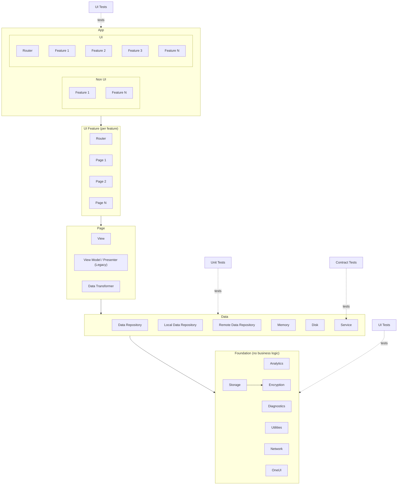

# Cloak — iOS App

Swift / SwiftUI iOS client. Handles E2EE message encryption/decryption on-device, real-time messaging over WebSockets (with long-poll fallback), and local AI inference via an on-device model (Gemma 3N or equivalent).

## Architecture

The app is structured in five horizontal layers. Dependencies flow strictly downward — upper layers depend on lower ones, never the reverse.



### Layers

#### App
The root module. Split into two sub-modules:
- **Non UI** — features that have no UI of their own (background sync, push handling, local AI inference). These are pure logic modules.
- **UI** — contains a top-level `Router` and one entry point per UI feature.

#### UI Feature
Each feature is its own module containing:
- A `Router` responsible for navigation within the feature
- One or more `Page` modules

#### Page
The unit of screen-level composition:
- **View** — SwiftUI view, purely declarative, no business logic
- **View Model / Presenter** — drives the view; use `ViewModel` for new pages, `Presenter` only in legacy screens
- **Data Transformer** — maps domain/data models to view-ready display models; keeps formatting logic out of the view and view model

#### Data
Abstracts all persistence and remote access behind a single `DataRepository` interface:
- **Local Data Repository** → `Memory` (in-process cache) and `Disk` (Core Data / file storage)
- **Remote Data Repository** → `Service` (network calls, WebSocket client)

All data stored or transmitted is encrypted before reaching this layer. The Service component handles WebSocket connections with long-poll fallback.

#### Foundation
Cross-cutting infrastructure. **No business logic.** Modules here are reusable across any app:
- **Analytics** — event tracking
- **Diagnostics** — crash reporting, logging
- **Utilities** — shared helpers, extensions
- **Network** — HTTP/WebSocket primitives
- **Storage** — raw read/write; used by the Disk repository and by **Encryption**
- **Encryption** — E2EE primitives (libsodium / Signal Protocol); called by Storage to ensure data is never written in plaintext
- **OneUI** — shared design system components

### Testing strategy

| Test type | Scope | Notes |
|-----------|-------|-------|
| UI Tests | App / UI features | Full navigation and interaction flows |
| Unit Tests | Data layer | Repository logic, transformers, caches |
| Contract Tests | Service | Verify the client honours the server API contract — against a mocked transport / recorded fixtures, not a live backend |
| UI Tests | Foundation / OneUI | Snapshot tests for design system components |

## Key rules

1. **No cross-layer skipping.** App → UI Feature → Page → Data → Foundation, in order. A View must never import a Foundation module directly (go through Data or a Transformer).
2. **Views are dumb.** No business logic, no formatting, no network calls in a `View`. All of that belongs in the ViewModel/Presenter or Data Transformer.
3. **Encryption at the boundary.** All plaintext is encrypted before it reaches `Storage` or `Service`. Nothing plaintext is written to disk or sent over the wire.
4. **On-device AI only.** The Non UI layer hosts the local model runner. No message content is sent to an external API.
5. **Legacy Presenter pattern** is permitted only in existing screens. All new pages use `ViewModel`.

## Operating principles — apply on every cycle

These govern every task regardless of which layer you're in. They mirror the server's operating principles (`server/CLAUDE.md` §0) so both halves of Cloak are built the same way.

1. **Ask, never assume.** Ambiguous requirement, unclear API/contract shape, undefined navigation flow, or a layer rule that doesn't obviously cover the case → stop and ask via `AskUserQuestion`. Never guess request/response shapes, optionality, key/token formats, error states, or which layer owns a responsibility.
2. **Validate every assumption.** Read the code, check the type, run the test before writing — re-verify after by running the test and launching the simulator. Notes and memory describe the world when they were written; confirm it still holds.
3. **TDD is mandatory.** Red → green → refactor on every feature, bug fix, and behaviour change (see below). No implementation ahead of a failing test.
4. **KISS.** The simplest design that meets the requirement. No speculative generality — a plain `struct` beats a protocol + generic until a second concrete case actually exists.
5. **DRY — single source of truth.** No duplicated logic, models, or constants across layers/modules. Apply the rule of three before extracting a shared abstraction.
6. **SOLID, Swift-idiomatically.** One responsibility per type; depend on protocols, not concretions; inject dependencies through initializers — never reach for singletons or globals; prefer value types and composition over inheritance. Follow the [Swift API Design Guidelines](https://www.swift.org/documentation/api-design-guidelines/) for naming and clarity.
7. **Privacy & encryption are non-negotiable.** Plaintext is encrypted before it reaches `Storage` or `Service`; AI inference stays on-device (Key rules 3 & 4). If a decision touches user data, default to the most restrictive option.
8. **Every change updates the README.** Any change to how the app is built, run, configured, or tested updates `app/README.md` in the same change set. Re-read it before declaring done.

## TDD is mandatory

Red → green → refactor on every feature, bug fix, and behaviour-affecting change.

- **Unit tests** (Swift Testing / XCTest) cover the **Data** layer — repositories, transformers, caches — and any domain logic in the Non UI layer.
- **Integration tests** exercise feature flows across layers (Page → Data → Service) against **mocked dependencies** — a mock `Service` / network client and in-memory fakes for repositories. **Mocks are the primary tool here:** the app isolates itself from the backend, so the suite is fast, hermetic, and runs on any machine or CI with **no Docker, no Testcontainers, and no live server**.
- **Contract checks** keep the mocks honest — base mock `Service` responses on the real server contract via shared / recorded fixtures, and refresh them when the contract changes, so mocking doesn't silently drift from reality.
- **UI tests** cover navigation and interaction flows through the App / UI features.
- **Snapshot tests** cover **OneUI** design-system components.

Write the failing test first. Unlike the server — which runs integration tests against real infrastructure (Testcontainers) — the **iOS app deliberately mocks its dependencies** so tests need no running backend. The trade-off (mocks can drift from the real server) is managed by the contract checks above.

## Module naming convention

```
Cloak<Layer><Feature>
e.g. CloakUIConversation, CloakDataMessaging, CloakFoundationEncryption
```
