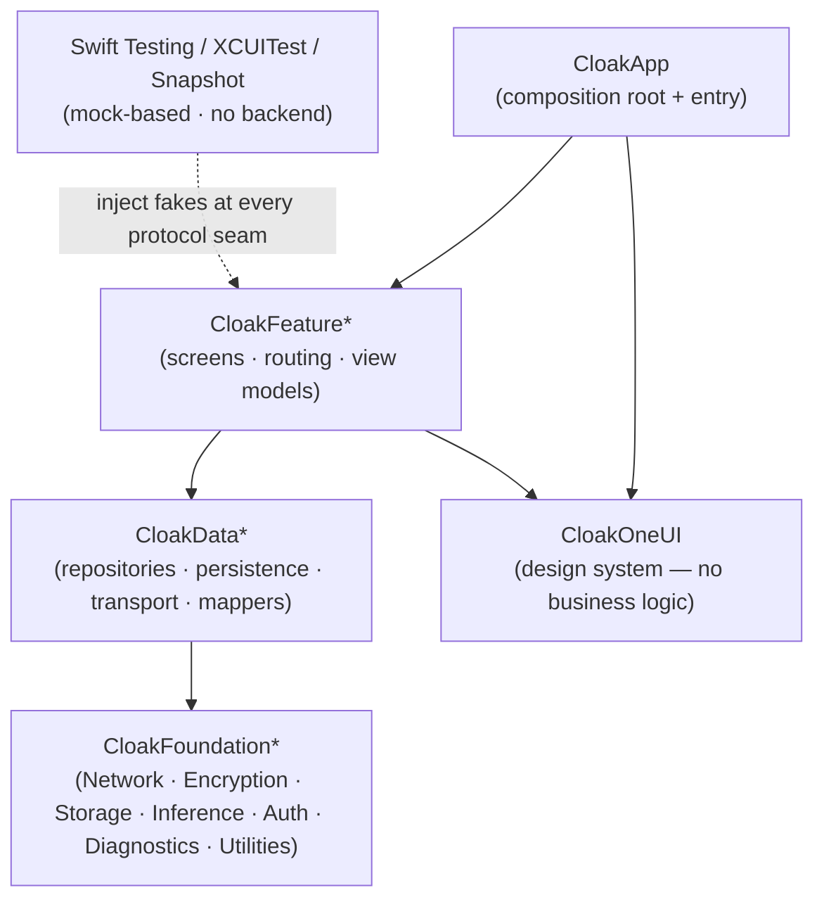

# CLAUDE.md — Swift/SwiftUI iOS Client Architecture Guide

This is the architecture source of truth for the **Cloak iOS client** — a privacy-first, end-to-end
encrypted messenger whose defining feature is that **all AI assistance runs on-device**. The guide is
deliberately opinionated and **mechanically enforced**: the module graph compiles the layering, lint and
coverage gates fail the build, and the patterns below are the canonical ones — not a menu. Read it
end-to-end before scaffolding a package, building a feature, or changing any boundary. The short
`app/CLAUDE.md` defers here; the product-level invariants live in the **root [`Cloak/CLAUDE.md`](../../CLAUDE.md)**.

---

## 0. Operating principles for Claude — read first, apply always

These are **behaviours**, not architecture. Apply them every cycle, every conversation, every refactor.
They mirror the server guide's §0 so both halves of Cloak are built the same way. If you violate them, the
rest of this guide is wasted effort.

### 0.1 Always ask, never assume

If a requirement is ambiguous, a contract shape isn't documented, or the existing pattern doesn't
unambiguously cover the case — stop and ask via `AskUserQuestion`. Do not guess.

Ask, never assume:
- The exact request / response (wire envelope) shape of a server endpoint or WebSocket frame
- Whether a field is optional / required / immutable, and what `nil` means
- The navigation flow — which screen owns a route, what "back" and deep-links do
- Which **layer** owns a responsibility (is this a Foundation capability, a Data repository, or feature logic?)
- Error states and how each should surface to the user
- Token / key formats, scopes, and refresh semantics
- Retention and deletion semantics for anything stored on device

The cost of one clarifying question is minutes; the cost of building the wrong thing is days plus the trust
hit of redoing it. When you have multiple plausible interpretations, present them as choices — don't pick
one silently.

### 0.2 Think hard, validate every assumption

**Before writing code:** state your assumptions; then confirm them — read the type, read the protocol, run
the test, launch the simulator, look at a real payload. Never build on "I think this works this way." Read it.

**Before claiming a task is done:** re-verify each assumption. Run the test. Launch the simulator and drive
the path. Trigger the failure case. If you skipped verification because "the change was small," verify it now
— small changes break most because they get the least scrutiny.

**Memory is a starting point, not a source of truth.** A note that names a type, file, or behaviour
describes the world *when it was written*. Confirm it still holds before acting on it.

**Smell list — if you think any of these, stop and validate:**
- "I'll assume the envelope shape is the same as the other frame."
- "It probably handles `nil`."
- "`@MainActor` is probably fine here." (Check the isolation.)
- "The protocol works like its name says." (Read it.)
- "The test will catch it." (Only if it actually asserts on it — check.)

### 0.3 Every change updates `app/README.md`

`app/README.md` is a **living artefact**. Every change to how the app is built, run, configured, or tested
updates the README **in the same change set** — no exceptions. New package, new build/lint/coverage step,
new run command, new minimum Xcode/iOS version, new tool dependency, an architecture decision worth
recording (a deviation from this guide, with rationale) — all require a README update. Before declaring a
task done, re-read the README and confirm it still describes the app you just changed.

### 0.4 Code-craft principles — DRY · KISS · SOLID, Swift-idiomatically

Every line must satisfy these. When they conflict, state the trade-off and choose the option that best
preserves future change-ability.

- **DRY — one source of truth.** One model per concept; one `*Mapper` per boundary; one config value in one
  place. Beware two paths that look identical but change for different reasons — apply the **rule of three**:
  extract a shared abstraction only when the **third** real duplicate appears and all three share an axis of
  change. Never abstract for two, even if identical today.
- **KISS / YAGNI.** The simplest design that meets the requirement. A plain `struct` beats a protocol +
  generic until a *second concrete case actually exists* (ports exist because adapters exist — not before).
  No speculative generality. Favour readable code over clever one-liners.
- **SOLID, applied here:**
  - **S — Single Responsibility.** A `View` renders. A `ViewModel` holds screen state + intents. A
    `Repository` persists. A `Mapper` translates. A `Transport` moves bytes. If a type starts doing two
    things, split it before adding more.
  - **O — Open/Closed.** Add behaviour by adding types (a new repository, a new `LocalAssistant` runtime),
    not by editing existing ones.
  - **L — Liskov.** Every concrete fully honours its protocol — no surprise `nil`, no surprise `throw`. A
    test written against the protocol passes against any conforming type (including the test fake).
  - **I — Interface Segregation.** Protocols are per-concern and hand-rolled. A screen depends only on the
    capabilities it uses.
  - **D — Dependency Inversion.** Depend on protocols, never concretions. Inject through initializers —
    **never** reach for a singleton or global. Concrete infra is always behind a protocol an inner layer owns.

Follow the [Swift API Design Guidelines](https://www.swift.org/documentation/api-design-guidelines/) for
naming and clarity. Prefer value types and composition over inheritance.

### 0.5 Every change is runnable + testable locally — with no backend

The whole test suite runs on any Mac or CI **with no running server, no Docker, no Testcontainers**. This is
the deliberate inverse of the server (which tests against real infra): the client isolates itself behind
protocol seams and **mocks its dependencies**, so the suite is fast, hermetic, and reproducible anywhere
(§14). One command generates the project, builds, and tests:

```bash
cd app && xcodegen generate && ./scripts/coverage.sh
```

If a change makes the app no longer testable without a backend — a new dependency with no protocol seam, a
test that reaches a real network or the file system outside a temp dir — add the seam (a protocol + a fake)
alongside the change, and verify on a clean checkout before merging. Manual end-to-end against the real
server (`./dev.sh up` + run on a simulator) is a separate, human-driven check — never a unit-test dependency.

### 0.6 Applying this guide to Cloak

This guide is the Cloak iOS client. Read the **root [`Cloak/CLAUDE.md`](../../CLAUDE.md)** first — it owns
the product invariants this section turns into engineering rules.

#### 0.6.1 Non-negotiable Cloak invariants (these sit *above* §0.1–§0.5 when they conflict)

- **End-to-end encryption is the client's job.** The server is untrusted with content and holds **ciphertext
  only**. Encryption and decryption happen here, on device. The plaintext a user types and the plaintext a
  user reads exist only on their devices.
- **On-device AI only.** No feature may send message content — plaintext *or* ciphertext — to a hosted LLM or
  any external AI provider. Inference runs locally (§9). There is no "call a cloud model" code path, and one
  must never be added.
- **Graceful degradation.** Messaging must behave identically over the primary WebSocket and the long-poll
  fallback (§8). Never design a flow that only works on one transport.
- **Privacy by design.** When a decision touches user data, default to the **most restrictive** option:
  shortest retention, least logging, narrowest exposure, encrypted at rest.
- **Minimal cleartext metadata.** Only the metadata strictly required to send/receive a message travels or is
  stored outside the encryption envelope. Everything else is encrypted with the body. Justify every cleartext
  field against this rule — when in doubt, encrypt it or ask.

#### 0.6.2 The privacy boundary, mapped onto this guide's sections

These are Cloak-specific constraints applied **on top of** the referenced sections:

- **§3 Presentation / §11 Errors:** A `View` or error message never carries another user's PII or raw payload.
  Surface stable, user-facing copy — never echo a failed message body.
- **§6 Data / §7 Crypto:** Plaintext lives only inside the encryption boundary and the encrypted-at-rest store
  (GRDB + SQLCipher). The DB key lives in the Keychain. The Signal Double Ratchet means a decrypted message
  **must** be persisted once and **cannot** be re-decrypted (§7.4) — so encryption-at-rest is mandatory, not
  optional.
- **§7.5 / §8 Transport:** Plaintext never crosses the encryption boundary **outward** — only ciphertext
  reaches the `MessageTransport`. The transport moves opaque bytes; it never inspects or logs them.
- **§9 On-device AI:** Prompts and responses never leave the device — no network, no log, no analytics.
- **§12 Observability:** Log identifiers and status (`messageId`, `conversationId`, trace id), **never** body,
  ciphertext, keys, tokens, or PII. Privacy redaction (`%{private}`) is the default, not the exception.

---

## 1. Architectural principles

### 1.1 Layered modules — the dependency rule

The app is four layers; **dependencies flow strictly downward**, never up or sideways across features:

```
App  →  Feature  →  Data  →  Foundation        (OneUI is Foundation-level, used by Feature + App)
```

- **App** — the composition root + entry point. Wires concrete implementations into protocols and injects them
  down. The only layer that knows every other.
- **Feature** — one vertical slice of product (a feature's screens, routing, and view models). A feature never
  imports another feature.
- **Data** — repositories, persistence, transport, and the mappers that translate at those boundaries. Exposes
  protocols upward; hides GRDB, libsignal, and `URLSession` from features.
- **Foundation** — cross-cutting capability with **no business logic**: networking primitives, the encryption
  boundary, storage, on-device inference, auth, diagnostics, utilities, and the OneUI design system. Reusable
  by any app.

A lower layer **cannot** import a higher one — and §2.1 makes that a *compile error*, not a guideline.

### 1.2 Protocol-defined seams

Every cross-layer boundary is a **protocol** owned by the consuming (inner) side; the concrete implementation
lives in the outer layer and is injected at the composition root (§5.3). The protocol is simultaneously the
abstraction features depend on and the **mock seam** the tests inject a fake into (§14). If a boundary isn't a
protocol, it isn't a boundary — and it can't be tested in isolation.

### 1.3 TDD is the inner development loop

Red → green → refactor on every feature, fix, and behaviour-affecting change. The primary surface is **Swift
Testing against mocks** — fast, hermetic, no backend (§0.5, §14). No production code is written ahead of a
failing test that requires it. UI flows get XCUITest; OneUI components get snapshot tests.

### 1.4 Privacy and on-device AI are structural, not advisory

The encryption boundary (§7), the on-device-inference boundary (§9), and the no-plaintext-logging rule (§12)
are enforced by **where types live and what they can import** — not by reviewer vigilance alone. Plaintext
types live behind the encryption boundary; a feature cannot reach `URLSession` to exfiltrate content because
it cannot import `CloakFoundationNetwork` directly (it goes through a Data repository). Design so that the
private thing is the *only easy thing*.



---

## 2. Project layout & modularization

The layering in §1.1 is enforced by the **SwiftPM package graph**: each layer×concern is a local package, and
a package can only reference packages it declares as dependencies. This is the iOS analogue of the server's
ArchUnit boundary — except it's checked by the *compiler*, so a violation can't even build.

### 2.1 The package graph compile-enforces the layering

```
app/
├── project.yml                 # XcodeGen — generates Cloak.xcodeproj (git-ignored)
├── Cloak/                      # CloakApp: @main entry + the composition root
└── Packages/
    ├── CloakFoundationUtilities/      # pure helpers, extensions (no deps)
    ├── CloakFoundationDiagnostics/    # OSLog wrappers, signposts, crash scrubbing
    ├── CloakFoundationStorage/        # GRDB + SQLCipher database provider, Keychain
    ├── CloakFoundationNetwork/        # URLSession / WebSocket primitives
    ├── CloakFoundationEncryption/     # libsignal wrapper — the encryption boundary
    ├── CloakFoundationInference/      # on-device LocalAssistant boundary
    ├── CloakFoundationAuth/           # AppAuth OIDC-PKCE
    ├── CloakOneUI/                    # design system (Royal & Spring tokens + components)
    ├── CloakDataMessaging/            # MessageRepository, transport, mappers
    ├── CloakDataIdentity/             # device/account/key repositories
    └── CloakFeatureConversation/      # the conversation feature (screens + view models)
```

A `Package.swift` declares exactly which packages a target may import. A Foundation package that tried to
`import CloakFeatureConversation` would not list it as a dependency — and would fail to compile:

```swift
// Packages/CloakFeatureConversation/Package.swift
let package = Package(
    name: "CloakFeatureConversation",
    platforms: [.iOS(.v17)],
    products: [.library(name: "CloakFeatureConversation", targets: ["CloakFeatureConversation"])],
    dependencies: [
        .package(path: "../CloakDataMessaging"),   // ↓ may reach Data
        .package(path: "../CloakOneUI"),           // → may reach the design system
        // NOTE: no sibling CloakFeature*; no CloakFoundationNetwork — a feature cannot
        // import another feature, nor reach a Foundation primitive directly. The graph forbids it.
    ],
    targets: [
        .target(name: "CloakFeatureConversation", dependencies: [
            .product(name: "CloakDataMessaging", package: "CloakDataMessaging"),
            .product(name: "CloakOneUI", package: "CloakOneUI"),
        ]),
        .testTarget(name: "CloakFeatureConversationTests",
                    dependencies: ["CloakFeatureConversation"]),
    ]
)
```

**Pragmatic path:** start with a handful of packages (the skeleton may live in a single app target) and split
along these seams as features grow. The *direction* is enforced from the first split onward — never let a
lower layer take a dependency on a higher one to "get it working."

### 2.2 Naming convention — `Cloak<Layer><Feature>`

```
Cloak<Layer><Feature>
  CloakFeatureConversation   CloakFeatureOnboarding
  CloakDataMessaging         CloakDataIdentity
  CloakFoundationEncryption  CloakFoundationNetwork   CloakFoundationInference
  CloakOneUI                 CloakApp
```

The package name states the layer (so an import line reveals a layering violation at a glance) and the concern.

### 2.3 File-suffix conventions — **enforce these**

One responsibility per type; the suffix names it. SwiftLint file-name + custom rules enforce these (§15.2).

| Role                              | Suffix            | Example                          |
|-----------------------------------|-------------------|----------------------------------|
| SwiftUI view (dumb)               | `View`            | `ConversationView`               |
| Screen state + intents            | `ViewModel`       | `ConversationViewModel`          |
| Navigation route (enum)           | `Route`           | `ConversationRoute`              |
| Feature navigation owner          | `Router`          | `ConversationRouter`             |
| Repository protocol + impl        | `Repository`      | `MessageRepository`, `SQLiteMessageRepository` |
| Network/WS boundary               | `Transport`       | `MessageTransport`               |
| Persisted-state store (Signal)    | `Store`           | `SignalSessionStore`             |
| External-SDK wrapper / API client | `Client`          | `KeycloakAuthClient`             |
| Boundary translation              | `Mapper`          | `MessageMapper`                  |
| View-ready value                  | `DisplayModel`    | `MessageDisplayModel`            |
| Domain / wire model               | `Model` (or none) | `Message`, `MessageEnvelope`     |
| Swift Testing suite               | `Tests`           | `ConversationViewModelTests`     |

### 2.4 What lives in each layer

- **App (`CloakApp`)** — the `@main` entry, the composition root (§5.3), app-lifecycle wiring, and the
  top-level router. No feature logic; no business rules.
- **Feature (`CloakFeature*`)** — a vertical slice: its `*View`s, `*ViewModel`s, `*Route`/`*Router`, and
  display mapping. Depends on Data protocols + OneUI. Never imports another feature or a Foundation primitive.
- **Data (`CloakData*`)** — repository protocols + their concrete implementations (GRDB, transport), and the
  `*Mapper`s that translate domain ↔ persistence ↔ wire. Hides infrastructure from features.
- **Foundation (`CloakFoundation*`)** — cross-cutting capability with **no business logic**: `Network`
  (URLSession/WebSocket), `Encryption` (libsignal boundary), `Storage` (GRDB+SQLCipher provider, Keychain),
  `Inference` (on-device AI boundary), `Auth` (AppAuth), `Diagnostics` (logging), `Utilities`.
- **OneUI (`CloakOneUI`)** — the design system: Royal & Spring tokens, reusable components, snapshot-tested.
  Foundation-level; importable by Feature + App; holds no business logic.

### 2.5 The composition root

Only **`CloakApp`** assembles the object graph — it builds concretes and injects them, protocol-typed, down
into features. Nothing below App constructs a sibling concrete or reaches for a singleton (§5).

```swift
// CloakApp — the one place concrete types are chosen and wired.
@main
struct CloakApp: App {
    private let environment = AppEnvironment.live()   // builds the graph once

    var body: some Scene {
        WindowGroup { RootView(environment: environment) }
    }
}

/// The composition root: concrete implementations chosen here, exposed as protocols.
struct AppEnvironment {
    let messageRepository: MessageRepository
    let auth: AuthService

    static func live() -> AppEnvironment {
        let db = try! EncryptedDatabase.openDefault()           // CloakFoundationStorage
        let transport = WebSocketMessageTransport()             // CloakFoundationNetwork seam
        return AppEnvironment(
            messageRepository: SQLiteMessageRepository(db: db, transport: transport),
            auth: KeycloakAuthService()
        )
    }
}
```

In tests, the composition root is replaced by fakes — `AppEnvironment(messageRepository: FakeMessageRepository(), …)`
— because every field is a protocol (§5.5, §14.3).

---

## 3. Presentation layer

SwiftUI + the **Observation framework** (`@Observable`). No `ObservableObject`/Combine for new code; no
legacy Presenter. One view model per screen; views are declarative and dumb.

### 3.1 Views are dumb

A `*View` renders state and forwards intents. No business logic, no formatting, no networking, no
persistence, no `Task` orchestration beyond a lifecycle `.task`. If a view needs a derived value, it comes
pre-computed on a `*DisplayModel` (§3.3).

```swift
struct ConversationView: View {
    @State private var model: ConversationViewModel       // owned here, injected at construction
    @State private var draft = ""

    var body: some View {
        VStack {
            List(model.messages) { MessageBubble(message: $0) }   // a OneUI component
            ComposeBar(text: $draft, onSend: { text in
                Task { await model.send(text) }                    // forward intent — no logic here
            })
        }
        .task { await model.onAppear() }                           // lifecycle only
    }
}
```

### 3.2 `@MainActor @Observable` view models — the canonical pattern

One view model per screen, `@MainActor`-isolated, holding `private(set)` state and exposing `async`
intents. It depends on **protocols** (injected via `init`), never concretes.

```swift
@MainActor @Observable
final class ConversationViewModel {
    private(set) var messages: [MessageDisplayModel] = []
    private(set) var connection: ConnectionState = .connecting

    private let repository: MessageRepository                       // protocol seam (§5)
    private let conversationId: ConversationId
    private var streamTask: Task<Void, Never>?

    init(conversationId: ConversationId, repository: MessageRepository) {
        self.conversationId = conversationId
        self.repository = repository
    }

    func onAppear() async {
        messages = (try? await repository.history(conversationId)).map(MessageDisplayModel.list) ?? []
        streamTask = Task { [weak self] in
            guard let self else { return }
            for await update in await repository.updates(conversationId) {
                self.messages.append(MessageDisplayModel(update))
            }
        }
    }

    func send(_ text: String) async {
        do { try await repository.send(text, to: conversationId) }   // repository encrypts + queues (§6–§8)
        catch { /* surface via state — never swallow (§11) */ }
    }

    deinit { streamTask?.cancel() }
}
```

State is `private(set)` so only intents mutate it. The view observes automatically (Observation tracks the
properties the body reads). **Never** put encryption, networking, or persistence here — delegate to the
repository.

### 3.3 Display models + mapping

Map domain/data models → view-ready `*DisplayModel` (formatted timestamps, localized status, resolved
colors) in a `*Mapper` or a `DisplayModel.init(_:)`, **outside the view and ideally outside the view
model**. Views and view models stay free of formatting logic; the mapper is the single source of truth for
"how a `Message` looks."

```swift
struct MessageDisplayModel: Identifiable, Equatable {
    let id: MessageId
    let body: String          // already-decrypted plaintext, for this device only
    let isMine: Bool
    let timestamp: String     // pre-formatted; the view never calls a DateFormatter
    let status: MessageStatus // Sending → Sent → Delivered → Read → Failed (§11.3)
}
```

### 3.4 Navigation — `NavigationStack` + enum routes

Each feature owns an enum `*Route` (its destinations) and a `*Router` that drives a `NavigationStack`
path. Type-safe, deep-link-friendly, testable; **no UIKit coordinators**.

```swift
enum ConversationRoute: Hashable {
    case thread(ConversationId)
    case details(ConversationId)
}

@MainActor @Observable
final class ConversationRouter {
    var path: [ConversationRoute] = []
    func open(_ route: ConversationRoute) { path.append(route) }
    func popToRoot() { path.removeAll() }
}
```

```swift
NavigationStack(path: $router.path) {
    ConversationListView(...)
        .navigationDestination(for: ConversationRoute.self) { route in
            switch route {
            case .thread(let id):  ConversationView(model: factory.conversation(id))
            case .details(let id): ConversationDetailsView(model: factory.details(id))
            }
        }
}
```

### 3.5 State, side effects, cancellation

- Use `.task {}` for the screen's appear-scoped work; SwiftUI cancels it on disappear automatically.
- For **long-lived** streams the view model owns the `Task` and cancels it (`deinit` or an explicit
  `onDisappear()` intent). Capture `self` weakly in retained tasks.
- Derive, don't store: computed display values come from a mapper, not duplicated `@State`.

### 3.6 Anti-patterns — refuse them

- Business logic, formatting, `DateFormatter`, or networking inside a `*View`.
- `ObservableObject` + `@Published` + Combine for new screens (use `@Observable`).
- Any surviving `Presenter` — the legacy pattern is removed, not extended.
- A "massive view model" that also does encryption/persistence/transport — push that to a repository.
- Mutating `NavigationPath` from deep child views instead of through the feature `Router`.
- A domain/wire type (`Message`, `MessageEnvelope`) used directly in a view — map to a `*DisplayModel` first.

---

## 4. Concurrency model

Swift 6 language mode with **complete concurrency checking**. Mutable infrastructure state is owned by
`actor`s; UI is `@MainActor`; everything crossing an isolation boundary is `Sendable`.

### 4.1 Swift 6 strict concurrency

Build under Swift 6 language mode with `-strict-concurrency=complete`. Data-race safety is a **compile
error**, not a runtime hope. `@unchecked Sendable` is forbidden without a written justification comment
explaining why the type is actually safe (e.g. it serializes access through a lock you can point to).

### 4.2 Actors for stateful infrastructure

Anything with mutable state shared across tasks is an `actor`: the WebSocket connection (§8), the Signal
store (§7), the database access layer (§6), and the on-device model runtime (§9). The actor serializes
access; callers `await` in.

```swift
actor WebSocketMessageTransport: MessageTransport {
    private var task: URLSessionWebSocketTask?
    private var outbox: [OutboundEnvelope] = []     // mutable state — protected by actor isolation

    func send(_ envelope: OutboundEnvelope) async throws {
        outbox.append(envelope)
        try await flush()
    }
    // receive loop, reconnection, flush … (§8)
}
```

### 4.3 `@MainActor` for UI

View models and view-facing types are `@MainActor`. They `await` into actors for I/O and never block the
main actor with synchronous work (no sync file/crypto/network on the main thread). UI mutations happen on
the main actor by construction, so there is no "dispatch back to main" boilerplate.

### 4.4 Structured concurrency

Prefer structured work: `async let` and task groups whose children are scoped to the call. Only retain a
`Task` for genuinely long-lived streams (an inbound message stream), and tie its lifetime to the owner
(cancel in `deinit`/on disappear). Don't spawn detached `Task {}`s that outlive their context.

### 4.5 Pitfalls — refuse them

- `@unchecked Sendable` to silence a warning instead of fixing the isolation.
- An unstructured `Task {}` that outlives its owner and leaks (or mutates freed state).
- Blocking the main actor with synchronous crypto, file, or network work.
- Capturing `self` strongly in a retained stream task (retain cycle / leaked work).
- Reaching across actor isolation with shared mutable reference types instead of `Sendable` values.

---

## 5. Dependency injection & composition

Manual **constructor injection** and a single composition root. No singletons, no globals, no service
locator, no DI framework. Every boundary is a protocol so tests inject fakes (§14).

### 5.1 Constructor injection only

Dependencies are protocol-typed `init` parameters. A type cannot acquire a collaborator any other way — no
`.shared`, no global, no ambient lookup. This makes the dependency graph explicit and every type trivially
testable.

```swift
// Good — the collaborator is a protocol parameter.
init(conversationId: ConversationId, repository: MessageRepository) { … }

// Refuse — a singleton hides the dependency and defeats testing.
// let repository = MessageRepository.shared
```

### 5.2 Protocol-per-boundary

Each Data/Foundation capability is a protocol (`MessageRepository`, `MessageTransport`, `AuthService`,
`LocalAssistant`, `KeyStorage`). The concrete (`SQLiteMessageRepository`, `WebSocketMessageTransport`) lives
behind it in the outer layer. Inner layers depend only on the protocol.

### 5.3 The composition root

`CloakApp` builds the object graph once (§2.5) and injects it down. A small factory turns the environment
into view models so features don't construct repositories themselves:

```swift
@MainActor
struct ViewModelFactory {
    let environment: AppEnvironment
    func conversation(_ id: ConversationId) -> ConversationViewModel {
        ConversationViewModel(conversationId: id, repository: environment.messageRepository)
    }
}
```

### 5.4 SwiftUI wiring

Pass view models by `init` and own them with `@State` at the screen root. Use `@Environment` **only** for
genuinely ambient values (theme, locale) — never as a DI backdoor to smuggle services past the composition
root.

### 5.5 Test seams

Because every boundary is a protocol, the suite injects in-memory fakes: `FakeMessageRepository`, a fake
`MessageTransport` with a controllable inbound stream, an in-memory encrypted database. No backend, no
network, no shared state (§14.3). If you find yourself wanting to mock a concrete type, the missing thing is
a protocol seam — add it.

### 5.6 Anti-patterns — refuse them

- `static let shared` singletons; global mutable state; service locators.
- A DI framework — constructor injection + the composition root is enough (KISS).
- Reaching for `@Environment` to inject a service instead of passing it through `init`.
- A view model constructing its own repository/transport (hidden dependency, untestable).

---

## 6. Data layer

The Data layer hides infrastructure (GRDB, libsignal, `URLSession`) behind **repository protocols** and
persists everything sensitive in a single **encrypted-at-rest store (GRDB + SQLCipher)**. Features depend on
the protocols; they never see SQL, libsignal, or sockets.

### 6.1 Repository protocols — the Data boundary

A repository exposes domain operations and returns domain/display types. Concrete implementations live in
`CloakData*`; features import only the protocol.

```swift
protocol MessageRepository: Sendable {
    func history(_ conversation: ConversationId) async throws -> [Message]
    func updates(_ conversation: ConversationId) async -> AsyncStream<Message>   // live timeline
    func send(_ text: String, to conversation: ConversationId) async throws       // encrypt → persist → queue
    func search(_ query: String) async throws -> [Message]
}
```

`send` is where the layers meet: the repository asks `CloakFoundationEncryption` to encrypt (§7), persists
the plaintext locally (§6.2, §7.4) and the outbound ciphertext to the outbox, and hands the ciphertext to
the `MessageTransport` (§8). A feature never orchestrates that itself.

### 6.2 GRDB + SQLCipher — the encrypted store

One SQLCipher-encrypted SQLite database (AES-256), opened through GRDB with a passphrase from the keystore
(§6.6). The provider lives in `CloakFoundationStorage`; repositories in `CloakData*` use it. **Why a local
plaintext store at all:** the Signal Double Ratchet deletes the message key on decrypt (§7.4), so decrypted
history *must* be persisted once and *cannot* be re-derived — which is exactly why it must be encrypted at
rest.

```swift
// CloakFoundationStorage — the only place SQLCipher is configured.
struct EncryptedDatabase {
    let pool: DatabasePool

    static func openDefault(keyStore: KeyStorage = KeychainKeyStorage()) throws -> EncryptedDatabase {
        var config = Configuration()
        config.prepareDatabase { db in
            try db.usePassphrase(try keyStore.databaseKey())   // SQLCipher key — never hard-coded
        }
        let url = try storeURL(excludedFromBackup: true)        // §6.6
        return EncryptedDatabase(pool: try DatabasePool(path: url.path, configuration: config))
    }
}
```

### 6.3 Schema, migrations, records

Versioned migrations via GRDB's `DatabaseMigrator`; `Codable` record structs; a `*Mapper` translates record
↔ domain so GRDB types never leak above the repository.

```swift
var migrator = DatabaseMigrator()
migrator.registerMigration("v1.messages") { db in
    try db.create(table: "message") { t in
        t.column("id", .text).primaryKey()
        t.column("conversationId", .text).notNull().indexed()
        t.column("body", .text).notNull()          // decrypted plaintext — encrypted at rest by SQLCipher
        t.column("isMine", .boolean).notNull()
        t.column("sentAt", .datetime).notNull()
        t.column("status", .text).notNull()         // §11.3 lifecycle
    }
}
```

### 6.4 Queries the messenger needs

Threads, **keyset pagination** (not `OFFSET`), unread counts, and **FTS5 full-text search inside the
encrypted database** (the search index is encrypted too, because the whole file is).

```swift
migrator.registerMigration("v2.messageSearch") { db in
    try db.create(virtualTable: "message_fts", using: FTS5()) { t in
        t.synchronize(withTable: "message")
        t.column("body")
    }
}
// search: SELECT message.* FROM message JOIN message_fts ON … WHERE message_fts MATCH ?
```

### 6.5 Caching

The encrypted DB is the source of truth; an optional in-memory cache fronts hot reads. Reads are
**offline-first** — render from the store immediately, reconcile when the transport delivers (§8). Never
introduce a second persistent source of truth.

### 6.6 Encryption-at-rest key handling

- The SQLCipher passphrase is a **random 256-bit key** generated on first launch and stored in the
  **Keychain** with `kSecAttrAccessibleAfterFirstUnlockThisDeviceOnly` (Secure-Enclave-gated where
  applicable). It is never in source, `UserDefaults`, or a plist.
- The store file is **excluded from iCloud/iTunes backups** and additionally protected with
  `NSFileProtectionComplete` for defense in depth.
- **Threat model:** defends device theft, forensic file extraction, and backup leakage (the file is
  ciphertext without the Keychain key). It does *not* defend a fully compromised, unlocked device with the
  app running — no client can, since keys must be in memory to decrypt.

### 6.7 Anti-patterns — refuse them

- GRDB/SQL types leaking above the repository protocol.
- Storing plaintext anywhere outside the SQLCipher store (no plaintext in `UserDefaults`, files, or logs).
- The DB key in `UserDefaults`/plist/source, or derived from something guessable.
- `OFFSET` pagination on large threads (use keyset); N+1 reads instead of a join.
- A second source of truth that can drift from the store.

---

## 7. Cryptography & the Signal boundary

`CloakFoundationEncryption` wraps **libsignal** and is the encryption boundary: plaintext exists inside it
(and the encrypted store), ciphertext is all that leaves. It exposes domain operations and hides libsignal
types entirely.

### 7.1 `CloakFoundationEncryption` — the boundary

```swift
protocol MessageCrypto: Sendable {
    /// Encrypts plaintext for a recipient device → opaque ciphertext for the transport.
    func encrypt(_ plaintext: Data, for recipient: DeviceAddress) async throws -> Ciphertext
    /// Decrypts an inbound envelope → plaintext (persisted once, §7.4).
    func decrypt(_ ciphertext: Ciphertext, from sender: DeviceAddress) async throws -> Data
}
```

The concrete drives the libsignal session cipher; callers (the `MessageRepository`) only see `Data` in and
`Ciphertext` out. No libsignal type appears above this boundary.

### 7.2 `SignalProtocolStore` over the encrypted store

libsignal needs identity, prekey, signed-prekey, and session stores. Implement them **backed by GRDB +
SQLCipher** (the §6 database) — the ratchet/session state is among the most sensitive data on the device and
gets the same encryption-at-rest as messages. Persistence flows through a repository, never through libsignal
globals.

```swift
// Conform libsignal's store protocols to the encrypted DB. Identity/prekeys/sessions
// are rows in the SQLCipher store; reads/writes go through the repository.
final class SignalSessionStore: SessionStore { /* load/store session records via EncryptedDatabase */ }
final class SignalIdentityStore: IdentityKeyStore { /* identity key in Keychain; trust state in the DB */ }
```

### 7.3 Key storage

- The long-term **identity private key** and the **DB key** live in the **Keychain** (Secure Enclave where
  the curve allows); session/ratchet state lives in the encrypted DB.
- Registration and **prekey replenishment** (uploading fresh one-time prekeys to the server's public-key
  registry) are named touchpoints; their full flow is elaborated at the slice that builds real sessions.

### 7.4 The "decrypt once → persist plaintext" rule — non-negotiable

The Double Ratchet **deletes the message key immediately after a successful decrypt** (forward secrecy).
Therefore: **decrypt exactly once, persist the plaintext to the encrypted store immediately, and never
attempt to re-decrypt the same ciphertext** — it is cryptographically impossible. This is *the* reason §6
exists. A bug that drops the decrypted plaintext before persisting loses the message permanently.

### 7.5 The encryption boundary invariant

Plaintext never crosses the boundary **outward** — not to `MessageTransport`, not to a log, metric, crash
report, analytics event, or off-device anything. Only `Ciphertext` reaches the transport. No message content
appears in any signal (§12). A type that holds decrypted content must not also hold a network or logging
collaborator — keep them in different types so the leak is structurally impossible (§1.4).

### 7.6 Multi-device (forward-looking)

A Signal session is per **recipient device**, not per user — sending to a user fans out to each of their
registered devices, and this device has its own identity. The boundary (per-device addressing, sender-key
or per-device encryption for fan-out) is fixed now; the full multi-device flow is elaborated at its slice.

### 7.7 Anti-patterns — refuse them

- Rolling custom crypto, or using anything but the audited libsignal for the protocol.
- Logging plaintext, keys, or ciphertext bytes (cross-ref §12); printing a key in a debug description.
- Holding decrypted content in a type that also touches the network/logging.
- Storing keys outside the Keychain, or session state outside the encrypted store.
- Re-decrypting (or trying to) a message already decrypted — it cannot work and signals a §7.4 violation.

---

## 8. Transport & delivery

The transport moves **opaque ciphertext** between this device and the server over WebSocket (primary) with a
transparent long-poll fallback. It is the boundary the tests mock, so the whole suite runs with no backend.

### 8.1 `MessageTransport` — the mock seam

```swift
protocol MessageTransport: Sendable {
    func connect(accessToken: String) async throws
    func send(_ envelope: OutboundEnvelope) async throws        // ciphertext only — never plaintext (§7.5)
    func inbound() async -> AsyncStream<InboundEnvelope>         // server-delivered envelopes
    func disconnect() async
}
```

`OutboundEnvelope`/`InboundEnvelope` mirror the server's wire contract (`docs/contracts/`). The transport
never inspects, decrypts, or logs the bytes (§7.5, §12). Features depend on this protocol; tests inject a
fake (§14.3).

### 8.2 The WebSocket actor

A `actor` owns the `URLSessionWebSocketTask`, attaches the bearer token, runs the receive loop, and yields
inbound envelopes onto the stream.

```swift
actor WebSocketMessageTransport: MessageTransport {
    private var socket: URLSessionWebSocketTask?
    private var continuation: AsyncStream<InboundEnvelope>.Continuation?

    func connect(accessToken: String) async throws {
        var request = URLRequest(url: Self.endpoint)
        request.setValue("Bearer \(accessToken)", forHTTPHeaderField: "Authorization")
        let socket = session.webSocketTask(with: request)        // session uses a pinned delegate (§16)
        self.socket = socket
        socket.resume()
        Task { await receiveLoop() }                              // owned by the actor; cancelled on disconnect
    }
}
```

### 8.3 Reconnection & backoff

Detect drops, reconnect with **exponential backoff + jitter**, re-subscribe idempotently, and publish a
`ConnectionState` the UI observes (§3.2). Reconnection never loses queued sends (§8.5).

### 8.4 Long-poll fallback — transparent degradation

When the WebSocket upgrade fails (restrictive networks, proxies), fall back to long-poll **behind the same
`MessageTransport` protocol**, so features and view models are unaffected. This is the graceful-degradation
invariant (root `CLAUDE.md` principle 4): a flow must behave identically on either transport.

### 8.5 Persisted offline outbox

Outbound messages are written to the **encrypted store first** (the outbox), sent when connected, marked
acked on receipt, and **replayed on reconnect** in order. A **client-generated message id** gives
idempotency/dedupe (the server and recipient drop duplicates). A send is never lost to a transient
disconnect — it waits in the outbox.

### 8.6 Acks, receipts, ordering

The transport surfaces delivery acks and read receipts; the repository maps them to the message-status
lifecycle (§11.3). Ordering is preserved by the outbox + server sequence; out-of-order inbound is sorted on
insert.

### 8.7 Contract fixtures

`OutboundEnvelope`/`InboundEnvelope` match the server contract; **shared/recorded fixtures from
`docs/contracts/` keep the mock transport honest** and are refreshed when the contract changes, so mocks
don't silently drift from the real server (§14.4).

### 8.8 Error surfacing

Transport errors surface to the user as clear state (a failed-to-send badge, an offline banner) — **never a
silently dropped message** (§11.4). A transient failure queues + retries; a permanent one marks the message
`Failed` with a retry affordance.

### 8.9 Anti-patterns — refuse them

- A feature importing `WebSocketMessageTransport` (the concrete) instead of the protocol.
- Any plaintext on the wire, or the transport decrypting/logging payloads.
- Dropping a send on a transient error instead of queueing it in the outbox.
- A flow that only works over WebSocket and breaks on long-poll.
- Server-trusting message order instead of using client ids + the outbox.

---

## 9. On-device AI boundary

All AI assistance runs **on device**. The boundary is a narrow protocol; the runtime behind it is pluggable
and chosen at its slice. **No prompt or response ever leaves the device** — no network, no log, no analytics.

### 9.1 `LocalAssistant` — the boundary

```swift
protocol LocalAssistant: Sendable {
    /// Streams generated tokens for a prompt built from on-device context only.
    func respond(to prompt: AssistantPrompt) -> AsyncThrowingStream<String, Error>
}
```

Lives in `CloakFoundationInference`. Features depend only on this protocol; swapping the model engine never
touches a feature.

### 9.2 Pluggable runtime

The concrete runtime — Core ML, MLX, or a llama-style engine — sits behind `LocalAssistant`. The **boundary
is fixed now; the runtime choice is deferred** to the slice that ships assistance. Selecting or upgrading the
engine is an `O` (open/closed) change: add/replace a conforming type, touch no feature.

### 9.3 Lifecycle, memory & cancellation

The model is an `actor` with explicit **load/unload** and a **memory budget** (the app must stay lean enough
to bundle a model — root `CLAUDE.md` principle 5). Generation is cancellable (the stream tears down its
work). Never load the model on the main actor.

### 9.4 Privacy — content never leaves the device

Inference is local-only. Prompts are built from on-device context (the user's own decrypted messages) and
**never** sent to any network, written to any log, or recorded in any analytics/metric (§7.5, §12). There is
no hosted-LLM code path, and adding one is forbidden (root `CLAUDE.md`).

### 9.5 Anti-patterns — refuse them

- Any SDK call to a hosted LLM / external AI provider for content (forbidden, full stop).
- Logging or analytics of prompts or responses.
- Loading or running the model on the main actor (jank / blocked UI).
- Leaking another user's plaintext into a prompt that crosses a boundary it shouldn't.

---

## 10. Auth

OIDC-PKCE against Keycloak via AppAuth, behind an `AuthService` protocol. Tokens live in the Keychain; the
access token is attached to the transport (§8).

### 10.1 `AuthService` — the boundary

```swift
protocol AuthService: Sendable {
    func login() async throws -> Session            // runs OIDC-PKCE; returns tokens + claims
    func validAccessToken() async throws -> String  // returns a live token, refreshing if needed
    func logout() async                             // clears the Keychain + closes the transport
}
```

The concrete `KeycloakAuthService` wraps AppAuth (the `cloak-ios` client); it is injected at the composition
root (§5.3). Features see only the protocol.

### 10.2 Token storage & refresh

Access + refresh tokens are stored in the **Keychain** (never `UserDefaults`, never view state). `validAccessToken()`
refreshes transparently on expiry and hands the bearer to the transport. **Tokens are never logged** (§12).

### 10.3 Session lifecycle

Model the states explicitly: unauthenticated → authenticating → authenticated (with silent refresh) →
logged-out. Logout clears the Keychain and tears down the transport + any model state. UI never blocks on a
refresh — it `await`s it off the main actor.

### 10.4 Anti-patterns — refuse them

- Tokens in `UserDefaults`, a plist, or passed through view/navigation state.
- Logging tokens or auth codes.
- Blocking the UI thread on a token refresh.
- A feature constructing `KeycloakAuthService` itself instead of receiving `AuthService` by injection.

---

## 11. Error handling & resilience

Errors are typed per boundary, surfaced to the user as clear state, and never silently swallowed. Transient
failures degrade gracefully; messages are never lost.

### 11.1 Typed errors per boundary

Each protocol declares a typed `Error`; map at boundaries (an anti-corruption step) so a libsignal or GRDB
error never reaches a view. No stringly-typed errors.

```swift
enum SendError: Error, Equatable {
    case notConnected        // transient — queue + retry (§8.5)
    case encryptionFailed    // programmer/state error — fail-fast, report
    case unauthorized        // refresh token (§10) then retry once
}
```

### 11.2 User-facing surfacing

Errors reach the user as **actionable state on the view model** (a banner, a per-message failed badge with
retry) — never a raw library error string, never another user's content. Transient transport errors degrade
gracefully (offline banner + queued send), not a crash or a blank screen.

### 11.3 The message-status lifecycle

The single source of truth for a message's UI state, matching the design-system spec:

```swift
enum MessageStatus: String, Codable {
    case sending, sent, delivered, read, failed
}
```

Transitions are set where the truth is: `sending` on enqueue (§8.5), `sent` on transport ack, `delivered`/
`read` on receipts (§8.6), `failed` on a permanent error (§11.4). The view renders the status from a
`MessageDisplayModel` (§3.3); it never computes it.

### 11.4 Retry vs fail-fast

- **Retry** transient transport/IO with backoff (disconnects, timeouts) — the outbox owns this (§8.5).
- **Fail-fast** on programmer errors and auth failures that retry can't fix (after one token refresh).
- **Never silently drop a message.** A dropped send is the one failure mode a messenger may not have; if it
  cannot be sent now, it stays in the outbox or is marked `failed` with a retry — visibly.

### 11.5 Anti-patterns — refuse them

- `try?` that swallows an error into `nil` with no surfacing.
- Force-unwrapping (`!`) remote/decoded data.
- Surfacing a raw `Error` description to the UI.
- Catching everything and continuing as if nothing happened (silent drop).

---

## 12. Client observability

Logging, signposts, and crash diagnostics that help debugging **without ever recording content, keys,
tokens, or PII**. Mirrors the server's §10 intent on the client side.

### 12.1 Structured logging with privacy redaction

Use `OSLog`/`Logger` with a subsystem + per-module category. **Privacy redaction is the default**: only
explicitly non-sensitive values are `%{public}`; everything else is redacted. Never log a message body,
ciphertext, key, token, or PII.

```swift
let log = Logger(subsystem: "com.cloak.app", category: "transport")
log.info("delivered messageId=\(id, privacy: .public) conv=\(conv, privacy: .public)")  // ids only
// NEVER: log.debug("body=\(plaintext)")  ← refuse — content must not be logged
```

### 12.2 Signposts & metrics

`os_signpost` (or `OSSignposter`) around performance-critical paths — connect/reconnect, encrypt/decrypt,
model inference. Any client metric carries identifiers/timings only, **never content or PII**.

### 12.3 Crash & diagnostics

`CloakFoundationDiagnostics` owns crash capture; reports are **scrubbed of content** before they leave the
process. A crash report must never carry a decrypted message or a key.

### 12.4 Correlation with the server

Where the server provides a trace/message id (the `X-Trace-Id` / envelope id), log it so a client report can
be lined up with a server trace. The client **never logs what the server is forbidden to** — the privacy bar
is identical on both halves.

### 12.5 Anti-patterns — refuse them

- `print()` in shipping code (use `Logger`).
- Logging request/response bodies, prompts, or responses.
- Content or PII in an analytics or metric event.
- `%{public}` on anything that could be sensitive "to make debugging easier."

---

## 13. Design system (OneUI)

`CloakOneUI` is the shared design system: Royal & Spring tokens + reusable components, snapshot-tested. It is
Foundation-level (importable by Feature + App) and holds **no business logic**.

### 13.1 The package

Components (`MessageBubble`, `ComposeBar`, buttons, avatars) and tokens live in `CloakOneUI`. A feature
composes them; it never re-styles or forks them. OneUI never imports Data/Feature and never reaches a
repository.

### 13.2 Tokens

Royal & Spring palette (purple `#6D28D9` + green `#22C55E` on black/white/grey), the type scale (all-SF + SF
Mono for safety numbers), 8-pt spacing, the radius set, and the message-status visuals — light + dark. The
**source of truth is the design-system spec**
([`docs/superpowers/specs/2026-06-10-cloak-design-system-design.md`](../../docs/superpowers/specs/2026-06-10-cloak-design-system-design.md));
OneUI *implements* it. Do not duplicate the spec's values here — reference it and keep one source of truth.

### 13.3 Snapshot tests

Every OneUI component has a **snapshot test** (light + dark, dynamic type) so visual regressions fail the
build (§14.2). Snapshots use stable, injected inputs — never live data or the current date.

### 13.4 Anti-patterns — refuse them

- Ad-hoc colors/fonts/spacing in a feature instead of a OneUI token.
- Forking or re-implementing a OneUI component inside a feature.
- Business logic, networking, or persistence inside OneUI.
- Duplicating the design-system spec's token values instead of referencing it.

---

## 14. TDD & testing strategy

TDD is the inner loop; **Swift Testing against mocks** is the primary surface. The suite is **hermetic** —
no backend, no Docker, no network, no shared state — so it runs on any Mac or CI. This is the deliberate
inverse of the server (which tests against real infrastructure); the client mocks at its protocol seams.

### 14.1 Swift Testing is the inner loop

Write the failing test first (`@Test` / `#expect`), make it pass minimally, refactor. Logic, data, and view
models are tested against injected fakes — no production code ahead of a failing test.

```swift
import Testing
@testable import CloakFeatureConversation

@MainActor
struct ConversationViewModelTests {
    @Test func send_appendsOptimisticMessage_andDelegatesToRepository() async throws {
        let repo = FakeMessageRepository()
        let model = ConversationViewModel(conversationId: .sample, repository: repo)
        await model.send("hello")
        #expect(repo.sent.map(\.text) == ["hello"])
        #expect(model.messages.last?.body == "hello")     // optimistic echo
    }
}
```

### 14.2 The test-type matrix

| Test type        | Tool          | Scope                                                              |
|------------------|---------------|-------------------------------------------------------------------|
| Logic / unit     | Swift Testing | view models, data repositories, mappers, domain logic — vs fakes  |
| Contract check   | Swift Testing | the mock `MessageTransport`/`AuthService` honour the server contract via shared/recorded fixtures |
| UI flow          | XCUITest      | navigation + interaction through a feature (still XCUITest, not Swift Testing) |
| Snapshot         | snapshot lib  | every OneUI component (light/dark, dynamic type)                   |

### 14.3 Mocks & fakes

Every boundary is a protocol, so the suite injects in-memory fakes: a `FakeMessageRepository`, a fake
`MessageTransport` with a controllable inbound stream, and an **in-memory encrypted GRDB** for data-layer
tests (open SQLCipher on `:memory:` so tests are deterministic and leave no file).

```swift
final class FakeMessageRepository: MessageRepository, @unchecked Sendable {
    private(set) var sent: [(text: String, to: ConversationId)] = []
    private var continuation: AsyncStream<Message>.Continuation?
    func send(_ text: String, to conversation: ConversationId) async throws { sent.append((text, conversation)) }
    func deliver(_ message: Message) { continuation?.yield(message) }   // drive inbound from the test
    // history/updates/search …
}
```

### 14.4 Contract fixtures keep mocks honest

The mock transport's envelopes come from **fixtures shared/recorded from `docs/contracts/`** (the server's
source of truth). Refresh them when the contract changes; a fixture-decode test fails if the wire shape
drifts — so mocking can't silently diverge from the real server (§8.7).

### 14.5 Coverage gate

`./app/scripts/coverage.sh` enforces **≥90% line coverage on meaningful files**; `*View.swift`, the app
entry, and generated code are excluded from the denominator (§15.3). The gate fails the build below
threshold.

### 14.6 Test naming

`test_<subject>_<condition>_<expectedResult>` (or a Swift Testing display name that reads the same way). One
behaviour per test; assert on **observable behaviour**, not on a mock's internals beyond what the behaviour
requires.

### 14.7 Pitfalls — refuse them

- Asserting a mock was called instead of asserting the resulting behaviour.
- `Task.sleep` to "wait for" async work instead of awaiting it (use confirmations/`await`).
- Tests that hit a real network or write outside a temp/in-memory store.
- UI tests doing business-logic assertions (push those down to Swift Testing).
- Snapshot tests with unstable inputs (live data, `Date()`).

---

## 15. Tooling, build & quality gates

### 15.1 XcodeGen + SwiftPM

`app/project.yml` generates `Cloak.xcodeproj` (git-ignored); local packages (§2.1) are declared as SwiftPM
dependencies. The package graph **is** the layering enforcement — a violation won't compile (§2.1).

### 15.2 SwiftLint

SwiftLint runs **strict** as a build phase (and in CI) — violations fail the build. Custom rules + file-name
rules enforce the §2.3 suffix conventions and ban the anti-patterns where lint can see them (`print(`,
`.shared`, `ObservableObject` in new code).

### 15.3 Coverage gate

The `xccov`-based `coverage.sh` (≥90%, with `*View.swift`/app-entry/generated excluded) runs locally and in
CI. Coverage is measured on meaningful code only.

### 15.4 CI

CI runs **lint → build → test → coverage**; green is required before review. Both reviews (skill-based +
human) gate merge, per root `CLAUDE.md`.

### 15.5 Config & secrets

Issuer/endpoint config is per-environment and checked in as non-secret defaults; runtime secrets (keys,
tokens) live only in the Keychain (§6.6, §10). No secret is ever committed.

---

## 16. Security hardening

A tight, enforce-able checklist on top of the boundaries above:

- **Keychain access controls** — `…ThisDeviceOnly`, Secure Enclave where the key type allows; the DB key and
  identity key never leave the Keychain (§6.6, §7.3).
- **TLS / certificate pinning** for the WebSocket and token endpoints (a pinned `URLSession` delegate); reject
  unexpected certs.
- **No plaintext logging** — content/keys/tokens never in a log, signpost, crash report, or analytics event
  (§12).
- **Backup exclusion** — the encrypted store and key material are excluded from iCloud/iTunes backups (§6.6).
- **Sensitive-screen hygiene** — consider redaction in the app switcher and limiting pasteboard/screenshot
  exposure for screens showing decrypted content.
- **Jailbreak awareness** — where it earns its keep, degrade or warn; never treat it as a substitute for the
  crypto guarantees.

---

## 17. Anti-patterns to refuse

A single scannable list (each is detailed in its section):

- **Layering:** a lower layer importing a higher one; a feature importing another feature or a Foundation
  primitive directly; bypassing a repository to reach `URLSession`/GRDB/libsignal from a feature.
- **Presentation:** logic/formatting/networking in a `View`; `ObservableObject`+Combine for new screens; a
  surviving `Presenter`; a domain/wire type used directly in a view; a massive view model that also
  encrypts/persists/transports.
- **Concurrency:** `@unchecked Sendable` to silence a warning; an unstructured `Task {}` that outlives its
  owner; blocking the main actor with sync work.
- **DI:** `static let shared` / globals / service locators; a DI framework; `@Environment` as a DI backdoor;
  a type constructing its own collaborators.
- **Data/crypto:** plaintext stored or logged outside the encrypted store; the DB/identity key outside the
  Keychain; rolling custom crypto; re-decrypting a message (impossible — §7.4); a type holding both decrypted
  content and a network/logging collaborator.
- **Transport/AI:** plaintext on the wire; dropping a send on a transient error instead of queueing; a flow
  that only works over WebSocket; **any** hosted-LLM call for content; logging prompts/responses.
- **Auth/observability:** tokens in `UserDefaults`/view state; logging tokens or content; `print()` in
  shipping code; `%{public}` on sensitive values.
- **Testing:** asserting on mocks instead of behaviour; `Task.sleep` instead of awaiting; tests hitting a
  real network/file; snapshot tests with unstable inputs.

---

## 18. New-feature bootstrap checklist

When adding a feature, in order:

1. **Pick the layer/package.** New feature → a `CloakFeature*` package; new capability → a `CloakData*`
   repository or a `CloakFoundation*` boundary. Don't widen an existing type's responsibility.
2. **Define the protocol seam(s).** The repository/transport/service protocol the feature depends on (§1.2,
   §5.2).
3. **Write the failing Swift Test** against a fake of that protocol (§14.1) — red.
4. **Implement behind the protocol** — the concrete in the outer layer; minimal code to pass — green; then
   refactor.
5. **Wire at the composition root** (§5.3) — inject the concrete; nothing below App constructs it.
6. **Build the screen** — `*View` (dumb) + `@Observable *ViewModel` + `*Route`/`*Router` + display mapping
   (§3); compose OneUI components (§13).
7. **Add UI + snapshot tests** (§14.2) for the flow and any new OneUI component.
8. **Honor the invariants** — plaintext stays behind the encryption boundary; nothing sensitive logged; AI
   stays on-device; both transports behave identically (§0.6).
9. **Update `app/README.md`** (§0.3) and run **lint + coverage** locally (§15).
10. **Open the PR** per root `CLAUDE.md` (rebase + squash; skill review + human review before merge).

