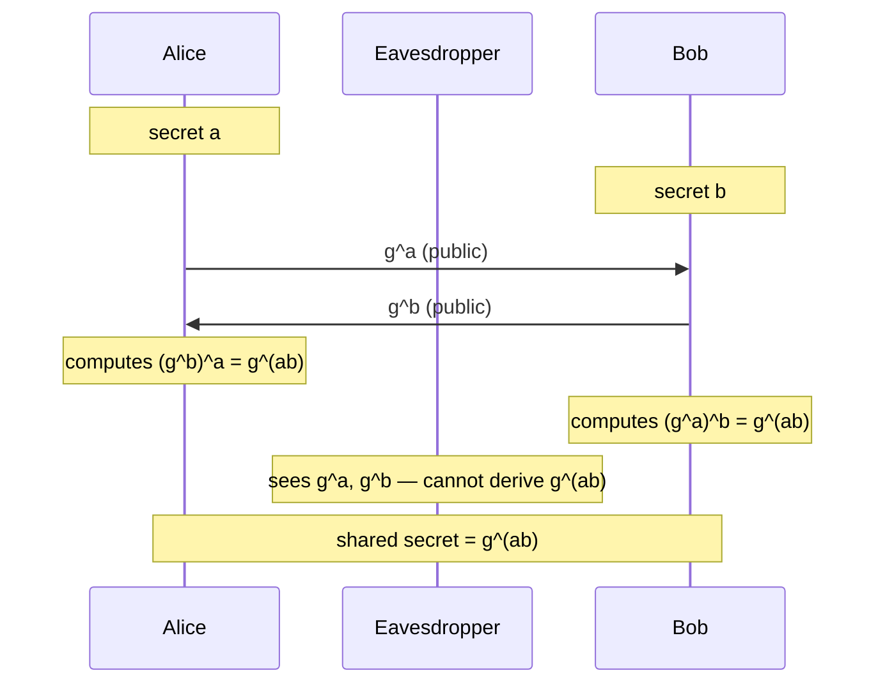
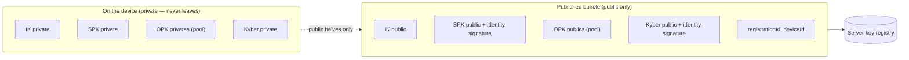
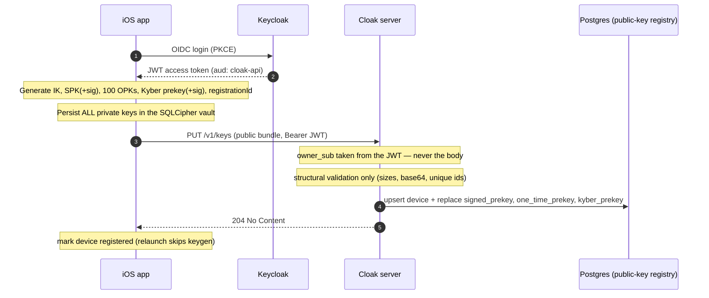
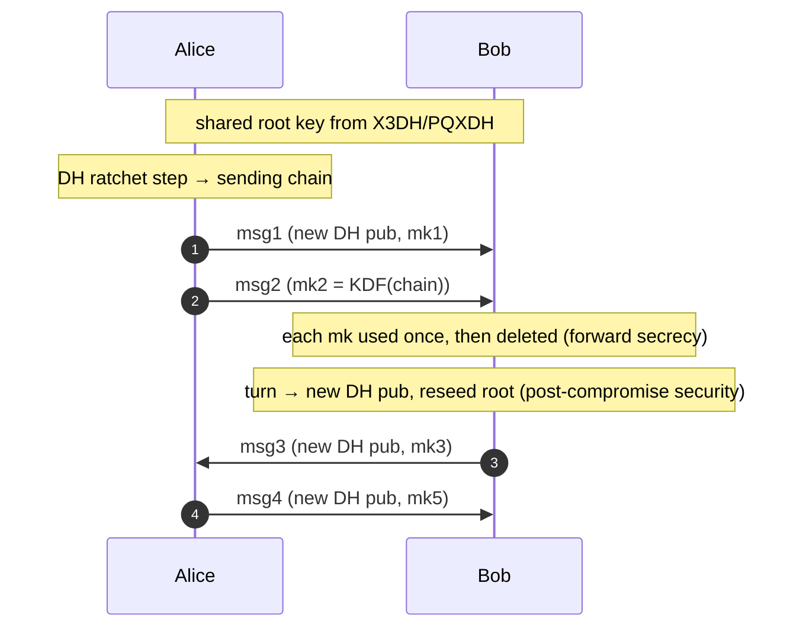
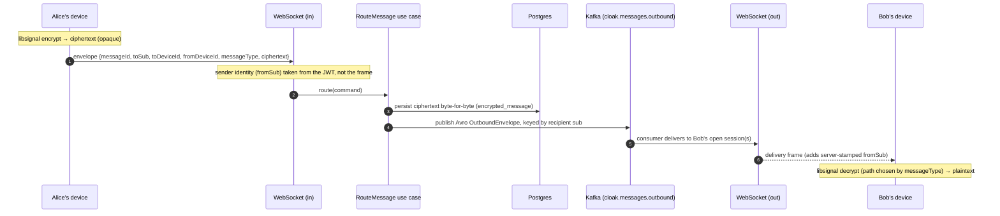
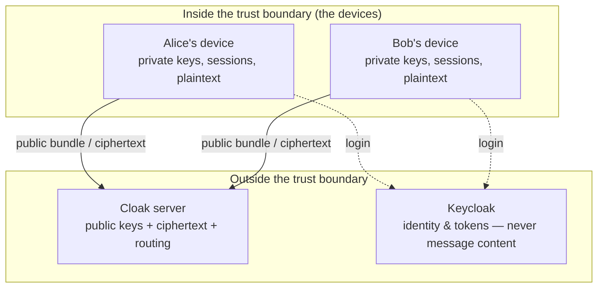

# Cloak Encryption — End-to-End Explained

A from-first-principles walkthrough of how Cloak protects messages: the cryptographic
building blocks, every key involved and why it exists, how a secure session is
established (X3DH → PQXDH), how ongoing messages stay secure (the Double Ratchet),
how the key material is stored on the client and the server, and why the storage is
split the way it is.

This document is **educational**. It explains the *mechanism and the reasoning*, not
the line-by-line code. Where a concept maps to a concrete Cloak table, file, or wire
field, that mapping is called out.

> **Mermaid diagrams** in this file render on GitHub and in most Markdown viewers.

---

## Table of contents

1. [The threat model — what we are defending against](#1-the-threat-model)
2. [Cryptographic building blocks](#2-cryptographic-building-blocks)
   - [Symmetric vs asymmetric](#21-symmetric-vs-asymmetric-encryption)
   - [Diffie–Hellman key exchange](#22-diffiehellman-key-exchange-dh)
   - [Digital signatures](#23-digital-signatures)
   - [KEMs and ML-KEM / Kyber (post-quantum)](#24-kems-and-ml-kem-kyber)
   - [KDFs — mixing secrets together](#25-kdfs--mixing-secrets-together)
3. [The cast of keys in Cloak](#3-the-cast-of-keys-in-cloak)
4. [The prekey bundle — public vs private](#4-the-prekey-bundle--public-vs-private)
5. [Publishing keys (Slice 1)](#5-publishing-keys-slice-1)
6. [Establishing a session: X3DH → PQXDH (Slice 2)](#6-establishing-a-session-x3dh--pqxdh)
7. [Ongoing messages: the Double Ratchet (Slice 3)](#7-ongoing-messages-the-double-ratchet)
8. [Message types on the wire](#8-message-types-on-the-wire)
9. [The full message path through Cloak's infrastructure](#9-the-full-message-path)
10. [Key storage — the SQL stores and why they are separate](#10-key-storage--the-sql-stores)
11. [Trust boundary recap](#11-trust-boundary-recap)
12. [Implementation status by slice](#12-implementation-status-by-slice)
13. [Glossary & references](#13-glossary--references)

---

## 1. The threat model

Cloak's core promise: **the server is untrusted with message content.** Encryption and
decryption happen only on the user's device; the server stores and routes **ciphertext**
and the minimum routing metadata, never plaintext and never private keys.

We design against several distinct adversaries, because different keys defend against
different threats:

| Adversary | What they can do | What defends us |
|-----------|------------------|-----------------|
| **Passive network eavesdropper** | Read traffic in transit | E2EE — only ciphertext crosses the wire |
| **Malicious / compromised server** | Read everything it stores, try to impersonate a user or hand out forged keys | Keys are signed by the user's identity key; the server only ever sees public keys + ciphertext |
| **Device seizure (later)** | Read what is stored on the phone now | Forward secrecy — old message keys are deleted and cannot be re-derived; storage is encrypted at rest |
| **Harvest-now, decrypt-later** | Record ciphertext today, break it with a future **quantum computer** | Post-quantum KEM (ML-KEM/Kyber) protects the initial handshake secret |

Two recurring security properties to keep in mind:

- **Forward secrecy (FS):** compromising a key *today* must not expose messages from the
  *past*. Achieved by using ephemeral, single-use keys and by deleting message keys after use.
- **Post-compromise security (PCS), a.k.a. self-healing:** if a key is compromised, the
  conversation should *recover* security after a few more exchanges. Achieved by the
  Double Ratchet continually injecting fresh randomness.

---

## 2. Cryptographic building blocks

This section is a primer. If you already know DH, signatures, KEMs, and KDFs, skip to
[§3](#3-the-cast-of-keys-in-cloak).

### 2.1 Symmetric vs asymmetric encryption

- **Symmetric:** one shared secret key encrypts and decrypts (e.g. AES). Fast, but both
  parties must already share the key — which is the hard part.
- **Asymmetric (public-key):** a key *pair* — a **public key** you can publish and a
  **private key** you keep secret. Others use your public key; only your private key
  reverses it.

Real systems use asymmetric crypto to *agree on* a symmetric key, then use the fast
symmetric key for the bulk work. Cloak is no different: all the machinery below exists to
let two phones agree on a shared secret without ever transmitting it.

### 2.2 Diffie–Hellman key exchange (DH)

Diffie–Hellman lets two parties derive a **shared secret over a public channel** — an
eavesdropper who sees everything transmitted still cannot compute it.

The intuition (classic DH): pick a public base `g`. Alice picks secret `a` and sends
`g^a`; Bob picks secret `b` and sends `g^b`. Alice computes `(g^b)^a = g^(ab)`; Bob
computes `(g^a)^b = g^(ab)`. They arrive at the **same** value `g^(ab)`, but an
eavesdropper who saw `g^a` and `g^b` cannot derive `g^(ab)` (the discrete-log problem).



**Elliptic-curve DH (ECDH / X25519).** Cloak uses the elliptic-curve form, X25519. The
idea is identical — a key pair `(private, public)`, and `DH(my_private, their_public)`
yields a shared secret — but it is faster and uses much smaller keys (32 bytes). Whenever
this document writes `DH(X, Y)` it means "the ECDH shared secret from X's private key and
Y's public key." Critically, `DH(A_priv, B_pub) == DH(B_priv, A_pub)`.

**Why DH alone is not enough:** a raw DH exchange has no *authentication* (you don't know
*who* `g^b` came from — a man-in-the-middle could substitute their own), it needs both
parties *online at the same time*, and a single DH gives no forward secrecy if the
long-term key leaks. X3DH (below) solves all three.

### 2.3 Digital signatures

A signature proves a message came from the holder of a particular private key and was not
altered. You **sign** with a private key; anyone **verifies** with the matching public key.

Cloak uses the identity key to **sign** the other prekeys. This is what stops a malicious
server from handing out forged keys: even though the server distributes the bundle, it
cannot forge the identity signature over a key it made up, and the recipient verifies that
signature before trusting the bundle.

### 2.4 KEMs and ML-KEM (Kyber)

DH is broken by a sufficiently large quantum computer (Shor's algorithm solves discrete
logs). A **Key Encapsulation Mechanism (KEM)** is the post-quantum replacement for "agree
on a shared secret using a public key":

- **Encapsulate(public_key) → (ciphertext, shared_secret).** The sender generates a fresh
  shared secret *and* a ciphertext that encodes it for the holder of `public_key`.
- **Decapsulate(private_key, ciphertext) → shared_secret.** The recipient recovers the
  same shared secret.

Cloak uses **ML-KEM-1024** (the standardized form of CRYSTALS-Kyber) via libsignal. The
KEM shared secret is mixed into the handshake alongside the DH secrets, so the initial
session key is safe **even against an adversary who recorded the traffic today and breaks
the DH parts with a future quantum computer** — they would still need to break ML-KEM,
which is designed to resist quantum attack. This is the "harvest-now, decrypt-later"
defense.

### 2.5 KDFs — mixing secrets together

A **Key Derivation Function** (HKDF in Signal) takes one or more input secrets and
produces uniformly-random output key material. Two uses in Cloak:

- **Combining handshake inputs:** the session key is `KDF(DH1 ‖ DH2 ‖ DH3 ‖ DH4 ‖ KEM_ss)`
  — feeding *all* the DH results and the KEM secret in means the output is secure as long
  as **any one** input was secure.
- **Ratcheting:** the Double Ratchet repeatedly does `(next_chain_key, message_key) =
  KDF(chain_key)`. Because a KDF is one-way, knowing a later chain key tells you nothing
  about earlier message keys — the mathematical basis of forward secrecy.

---

## 3. The cast of keys in Cloak

Each device owns several key pairs with different lifetimes and jobs. The *public* halves
are published to the server (the "bundle"); the *private* halves never leave the device.

| Key | Lifetime | Signed by | Single-use? | Public half published? | Purpose |
|-----|----------|-----------|-------------|-------------------------|---------|
| **Identity key (IK)** | Long-term (per device, forever) | — (it is the root of trust) | No | Yes | *Who you are.* Signs the other prekeys; binds the session to your identity. |
| **Signed prekey (SPK)** | Medium-term (rotated periodically — Slice 9) | Identity key | No (reused until rotated) | Yes | A DH key the server can distribute but cannot forge. Gives medium-term forward secrecy. |
| **One-time EC prekey (OPK)** | Single session | — (its presence is authenticated via the signed prekey + IK in the handshake) | **Yes** — consumed on use | Yes (a pool of ~100) | Per-session forward secrecy: a fresh DH key for each new conversation initiation. |
| **Last-resort Kyber prekey (PQPK)** | Medium-term (rotated — Slice 9) | Identity key | No (reusable; Slice 9 adds a one-time pool) | Yes | Post-quantum protection of the handshake (the KEM target). |
| **Ephemeral key (EK)** | One handshake | — | Yes | No (sent inside the first message) | The initiator's throwaway DH key for *this* handshake. The engine of forward secrecy. |
| **Registration ID** | Per device | — | — | Yes (an integer, not a key) | A libsignal identifier disambiguating installs. |
| **Device number** | Per device | — | — | Yes | libsignal device id; `1` for the primary device (multi-device is Slice 5). |

A few clarifications people often want:

- **Why a *signed* prekey at all?** The server distributes it, so we must prevent the
  server substituting its own. The identity signature over the SPK is the proof. It is
  reused (not single-use) so that even an offline recipient always has *one* DH key
  available; rotating it periodically (Slice 9) limits how much is exposed if it leaks.
- **Why *one-time* prekeys on top of the signed prekey?** Each gives a *fresh* DH input
  for a new conversation, so compromising the device later cannot retroactively expose the
  initial secret of past conversations that used (now-deleted) one-time keys. They are a
  finite pool and get consumed — hence the server tracks consumption and Slice 9
  replenishes them.
- **Why is the Kyber prekey "last-resort / reusable" today?** See the
  [PQXDH amendment spec](superpowers/specs/2026-06-27-pqxdh-amendment-design.md). A single
  reusable Kyber key is valid PQXDH and mirrors the signed prekey; one-time Kyber prekeys
  (per-session PQ forward secrecy) arrive with replenishment in Slice 9.

---

## 4. The prekey bundle — public vs private

The single most important split in the whole system:



The bundle lets **someone who is offline-to-you** still start a secure conversation: they
fetch your published public keys from the server and run the handshake without you being
online. That asynchrony is the whole reason prekeys exist (a plain DH needs both parties
online simultaneously).

The wire shape Cloak uses (see `docs/contracts/slice1-device-key-bundle.md` and
`slice2-prekey-bundle.md`):

```jsonc
{
  "registrationId": 12345,
  "deviceId": 1,
  "identityKey":  "base64",
  "signedPreKey":  { "keyId": 1, "publicKey": "base64", "signature": "base64" },
  "oneTimePreKeys":[ { "keyId": 1, "publicKey": "base64" }, ... ],   // PUT: a pool
  "kyberPreKey":   { "keyId": 1, "publicKey": "base64 (ML-KEM-1024)", "signature": "base64" }
}
```

On **fetch** (`GET /v1/keys/{sub}`) the server returns the identity key, the signed
prekey, **one** one-time prekey (consumed atomically — see §10), and the Kyber prekey.

---

## 5. Publishing keys (Slice 1)

On first launch, after the user authenticates with Keycloak, the device generates all its
keys, stores the **private** material locally (encrypted), and publishes the **public**
bundle.



Two design rules visible here:

- **The owner identity comes from the validated JWT `sub`, never the request body** — the
  same anti-spoofing rule used everywhere in Cloak.
- **The server does *structural* validation only** (correct sizes, valid base64, unique
  key ids). It does **not** cryptographically verify the prekey signatures — that trust
  decision belongs to the *recipient* during the handshake, keeping the server
  content-blind.

---

## 6. Establishing a session: X3DH → PQXDH

This is the heart of the system. Suppose **Alice** wants to message **Bob**, who is
offline. Alice fetches Bob's bundle and performs the handshake unilaterally.

### 6.1 The DH combinations (X3DH = "Extended Triple Diffie–Hellman")

Alice generates a fresh **ephemeral key `EK_A`** for this handshake, and computes a set of
DH values, each chosen for a specific reason:

| Combination | Inputs | Why it exists |
|-------------|--------|---------------|
| **DH1** | `DH(IK_A, SPK_B)` | Binds **Alice's identity** to Bob's signed prekey → authenticates Alice to Bob. |
| **DH2** | `DH(EK_A, IK_B)` | Binds **Bob's identity** to Alice's ephemeral → authenticates Bob to Alice. |
| **DH3** | `DH(EK_A, SPK_B)` | Ephemeral × Bob's medium-term key → forward secrecy. |
| **DH4** | `DH(EK_A, OPK_B)` | Ephemeral × Bob's **one-time** key → *per-session* forward secrecy. (Omitted if Bob's one-time prekeys are exhausted.) |

The deliberate "crossover" (Alice's *identity* with Bob's *prekey* in DH1, and Alice's
*ephemeral* with Bob's *identity* in DH2) is what gives **mutual authentication** — each
side proves possession of their identity private key. The ephemeral key in DH3/DH4 is what
gives **forward secrecy**: once `EK_A` is deleted, those secrets can never be recomputed.

### 6.2 The post-quantum leg (PQXDH)

Alice additionally **encapsulates against Bob's Kyber prekey**:

```
(KEM_ct, KEM_ss) = Encapsulate(PQPK_B_public)
```

She will send `KEM_ct` to Bob; Bob recovers `KEM_ss = Decapsulate(PQPK_B_private, KEM_ct)`.

### 6.3 Deriving the session key

```
SK = KDF( DH1 ‖ DH2 ‖ DH3 ‖ DH4 ‖ KEM_ss )
```

Because every input is concatenated into the KDF, `SK` stays secret as long as **any
single** input was secret. Classical DH protects against today's adversaries; the KEM
secret protects against a future quantum adversary — belt and braces.

Before computing anything, Alice **verifies the identity signatures** on Bob's signed
prekey and Kyber prekey. If either fails, she aborts — this is the check that defeats a
malicious server handing out forged keys.

### 6.4 The handshake, end to end

```mermaid
sequenceDiagram
    autonumber
    participant A as Alice (initiator)
    participant Srv as Cloak server
    participant B as Bob (offline)

    A->>Srv: GET /v1/keys/{bob}
    Note over Srv: atomically consume ONE of Bob's one-time prekeys
    Srv-->>A: IK_B, SPK_B(+sig), OPK_B, PQPK_B(+sig), ids
    Note over A: verify SPK_B & PQPK_B signatures against IK_B (abort if bad)
    Note over A: generate EK_A; compute DH1..DH4; Encapsulate→(KEM_ct, KEM_ss)
    Note over A: SK = KDF(DH1‖DH2‖DH3‖DH4‖KEM_ss); init Double Ratchet
    Note over A: encrypt "hello" → PreKeySignalMessage (type 3)
    A->>Srv: send envelope {toSub:bob, messageType:3, ciphertext, EK_A, OPK id, KEM_ct, ...}
    Note over Srv: store ciphertext, route — never decrypts
    Srv-->>B: deliver envelope (when Bob connects)
    Note over B: read EK_A, IK_A, OPK id, KEM_ct from the message
    Note over B: recompute DH1..DH4 (mirror inputs); KEM_ss = Decapsulate(PQPK_B_priv, KEM_ct)
    Note over B: SK = KDF(...) — identical to Alice's; init Double Ratchet
    Note over B: decrypt → "hello"; delete the consumed OPK private
```

Note what travels in that first message: the ciphertext **plus** the public material Bob
needs to reconstruct `SK` — Alice's ephemeral public key, her identity public key, the id
of the one-time prekey she consumed, and the KEM ciphertext. That is precisely what makes
a **PreKeySignalMessage** larger than a normal message, and why it is tagged
`messageType: 3` (see §8). libsignal packs all of this into the serialized blob; Cloak
treats it as opaque bytes.

---

## 7. Ongoing messages: the Double Ratchet

X3DH/PQXDH establishes the *first* shared secret. Every message after that is protected by
the **Double Ratchet**, which gives a fresh key per message with both forward secrecy and
post-compromise security. (This is **Slice 3** in Cloak.)

It is "double" because it combines two ratchets:

- **Symmetric-key ratchet (the KDF chain).** Each message advances a chain:
  `(chain_key', message_key) = KDF(chain_key)`. The `message_key` encrypts exactly one
  message and is then **deleted**. Because KDFs are one-way, an attacker who learns a later
  chain key cannot derive earlier message keys → **forward secrecy** at per-message
  granularity.
- **Diffie–Hellman ratchet.** Whenever the direction of conversation turns, the sender
  includes a **new ephemeral DH public key**; both sides do a fresh DH and feed it into a
  root KDF that reseeds the chains. This continual injection of new randomness means that
  if an attacker ever compromises the current keys, they are locked out again after the
  next round trip → **post-compromise security (self-healing)**.



The ratchet also tolerates **out-of-order / missing messages** by caching skipped message
keys — also part of Slice 3.

> **Why this forces encrypted-at-rest storage on the device.** To decrypt a message you
> receive while the conversation has moved on, and to display conversation history, the
> device must keep ratchet state and decrypted history locally. That local plaintext is
> exactly what an attacker with the device wants — so Cloak stores it in a
> **SQLCipher-encrypted** database (see §10). Forward secrecy on the wire would be
> pointless if the phone kept everything in cleartext.

---

## 8. Message types on the wire

libsignal produces two kinds of ciphertext, and the recipient must pick the right
decryption path:

| `messageType` | libsignal type | When | Carries |
|---------------|----------------|------|---------|
| **3** | `PreKeySignalMessage` | The **first** message of a session (or re-establishment) | The X3DH/PQXDH setup material (initiator's ephemeral + identity public keys, consumed one-time prekey id, KEM ciphertext) **plus** the encrypted payload |
| **2** | `SignalMessage` (normal "whisper") | Every subsequent message | Just the Double-Ratchet-encrypted payload + the current ratchet public key |

Cloak carries this as an explicit `messageType` field in the message envelope (see
`docs/contracts/slice2-message-envelope.md`). It is the one extra cleartext bit the server
sees per message; its principle-6 justification is that the recipient needs it to choose
`signalDecryptPreKey` vs `signalDecrypt`. (It is revisited together with `fromSub` under
future sealed-sender hardening.)

---

## 9. The full message path

Tying the crypto to Cloak's actual infrastructure. The key point: **the ciphertext is
opaque from the moment it leaves the sender's libsignal until the recipient's libsignal
decrypts it.** Every hop in between — WebSocket, server, Postgres, Kafka — handles only
opaque bytes plus routing metadata.



What the server **does** see (all justified as the minimum needed to route): `messageId`,
sender & recipient `sub`, device numbers, `messageType`. What it **never** sees: the
plaintext, the private keys, the session/ratchet state.

---

## 10. Key storage — the SQL stores

Both sides store keys in SQL, but for opposite reasons: the **client** holds the
**private** material (and must protect it), while the **server** holds a registry of
**public** material (and must serve it). libsignal further insists the client expose its
key material through *separate typed stores*, which is why you see distinct tables rather
than one blob.

### 10.1 Client (iOS) — the SQLCipher-encrypted vault

The device opens a single GRDB database encrypted with **SQLCipher**; the passphrase is
generated once and held in the **iOS Keychain** (`EncryptedDatabase` + `KeychainSecret`).
Inside it, libsignal's store protocols are implemented over these tables (`SignalKeyStore`):

| Table | libsignal store | Holds | Lifecycle |
|-------|-----------------|-------|-----------|
| `local_identity` (single row) | `IdentityKeyStore` | This device's identity key pair + registration id | Written once at registration |
| `peer_identity` (name → key) | `IdentityKeyStore` | Other users' identity public keys, for trust-on-first-use | Grows as you talk to people |
| `prekey` (id → record) | `PreKeyStore` | One-time EC prekey **private** keys | Each deleted when consumed |
| `signed_prekey` (id → record) | `SignedPreKeyStore` | Signed prekey private key | Rotated (Slice 9) |
| `kyber_prekey` (id → record) | `KyberPreKeyStore` | Kyber prekey private key | Last-resort, reusable (Slice 9 adds rotation/one-time) |
| `session` (address → record) | `SessionStore` | Double Ratchet session state per peer device | Created at handshake, advanced per message |

**Why separate stores instead of one table?** Three reasons:

1. **The libsignal protocol calls them at distinct points.** During a PreKey decrypt,
   libsignal independently asks the `PreKeyStore` for a one-time prekey, the
   `SignedPreKeyStore` for the signed prekey, the `KyberPreKeyStore` for the Kyber prekey,
   the `IdentityKeyStore` for identities, and the `SessionStore` for session state. Typed
   stores match the protocol's contract directly.
2. **Different lifecycles and operations.** One-time prekeys are *deleted on use*; the
   signed/Kyber prekeys are *replaced on rotation*; sessions are *updated every message*;
   the local identity is *write-once*. Separate tables make those operations clean and
   keep one concern per table.
3. **Separation of concerns / least surprise.** Each store has one responsibility and a
   well-defined interface, which is easier to reason about, test, and audit — and matches
   how Signal's own clients are built.

Everything in this database is **private** and must never leave the device — hence
encryption at rest.

### 10.2 Server (Postgres) — the public-key registry + ciphertext store

The server stores only **public** keys (to distribute in bundles) and **ciphertext** (to
persist/route). Schema via Flyway migrations in `db/migrations`:

| Table | Holds | Notes |
|-------|-------|-------|
| `device` | `owner_sub`, identity public key, `registration_id`, `device_number` | One row per user device; owner is the authenticated `sub` |
| `signed_prekey` | Signed prekey **public** key + identity signature | One per device, replaced on re-publish |
| `one_time_prekey` | One-time prekey **public** keys + `consumed_at` | A pool; one consumed per fetch |
| `kyber_prekey` | Kyber prekey **public** key + identity signature | One per device (last-resort); Flyway `V3` |
| `encrypted_message` | `messageId`, sender/recipient `sub`, **ciphertext** | Opaque bytes, stored byte-for-byte; never decrypted |

**The one-time prekey consumption problem.** Because each one-time prekey must be handed
out **exactly once**, the fetch endpoint claims one atomically:

```sql
UPDATE one_time_prekey SET consumed_at = now()
WHERE (device_id, key_id) IN (
  SELECT device_id, key_id FROM one_time_prekey
  WHERE device_id = ? AND consumed_at IS NULL
  ORDER BY key_id LIMIT 1
  FOR UPDATE SKIP LOCKED)
RETURNING key_id, public_key;
```

`FOR UPDATE SKIP LOCKED` means two simultaneous fetchers can never be handed the same
prekey — each skips a row the other has locked. If the pool is exhausted, the bundle is
returned **without** a one-time prekey (the handshake omits DH4 — still valid, slightly
reduced forward secrecy until Slice 9 replenishes). The signed prekey and the **reusable**
Kyber prekey have no `consumed_at` — they are served as-is to everyone.

### 10.3 Client vs server, side by side

| | Client store (iOS / SQLCipher) | Server store (Postgres) |
|-|-------------------------------|-------------------------|
| Holds | **Private** keys + session state + (later) plaintext history | **Public** keys + ciphertext |
| Purpose | Decrypt/encrypt; remember sessions | Distribute bundles; persist & route ciphertext |
| Protection | Encrypted at rest (SQLCipher + Keychain) | Public data; ciphertext is already encrypted |
| If stolen | Encryption-at-rest + forward secrecy limit damage | No plaintext, no private keys to steal |

---

## 11. Trust boundary recap



- **Devices** are inside the trust boundary: they hold private keys, derive session keys,
  and see plaintext.
- The **server** is outside it: it is a relay and a public-key directory. Even fully
  compromised, it sees only ciphertext, public keys, and routing metadata.
- **Keycloak** authenticates *who* you are (and issues JWTs the server validates) but never
  touches message content — E2EE keeps it outside the confidentiality boundary entirely.

---

## 12. Implementation status by slice

| Capability | Slice | Status |
|------------|-------|--------|
| Identity + signed + one-time EC prekey generation, publish, registry | Slice 1 | ✅ Done |
| Recipient lookup, bundle fetch (atomic OTP claim), X3DH session, first real encrypted message | Slice 2 | 🔜 In progress |
| Last-resort Kyber prekey (PQXDH) end-to-end | PQXDH amendment (within Slice 2) | 🔜 Planned |
| Double Ratchet, persisted/restored history, out-of-order tolerance | Slice 3 | ⬜ Upcoming |
| Offline delivery, multi-device fan-out | Slices 4–5 | ⬜ Upcoming |
| One-time Kyber prekeys, prekey replenishment, key rotation, revocation | Slice 9 | ⬜ Upcoming |

See `docs/superpowers/specs/` for the per-slice designs, and the contract artifacts in
`docs/contracts/` for the exact wire shapes.

---

## 13. Glossary & references

**Glossary**

- **E2EE** — end-to-end encryption; only the endpoints can read content.
- **DH / ECDH / X25519** — Diffie–Hellman key agreement; the elliptic-curve form Cloak uses.
- **KEM / ML-KEM / Kyber** — key encapsulation mechanism; the post-quantum way to agree a
  secret. ML-KEM-1024 is the standardized Kyber.
- **X3DH** — Extended Triple Diffie–Hellman; Signal's asynchronous session-setup protocol.
- **PQXDH** — X3DH plus a post-quantum KEM leg.
- **Double Ratchet** — Signal's per-message key evolution giving forward secrecy + PCS.
- **KDF / HKDF** — key derivation function; mixes/expands secrets one-way.
- **Forward secrecy (FS)** — past messages stay safe if a key leaks later.
- **Post-compromise security (PCS)** — the session self-heals after a compromise.
- **Prekey** — a key published in advance so others can start a session while you're offline.
- **Identity / signed / one-time / Kyber prekey** — see [§3](#3-the-cast-of-keys-in-cloak).
- **PreKeySignalMessage / SignalMessage** — the first vs subsequent ciphertext types.

**References (the protocols Cloak follows, via libsignal)**

- Signal X3DH specification — <https://signal.org/docs/specifications/x3dh/>
- Signal PQXDH specification — <https://signal.org/docs/specifications/pqxdh/>
- Signal Double Ratchet specification — <https://signal.org/docs/specifications/doubleratchet/>
- NIST FIPS 203 (ML-KEM) — <https://csrc.nist.gov/pubs/fips/203/final>
- libsignal — <https://github.com/signalfoundation/libsignal>

> Cloak does **not** roll its own crypto. These mechanisms are implemented by the
> well-audited libsignal library on iOS; this document explains *what it is doing and why*.
